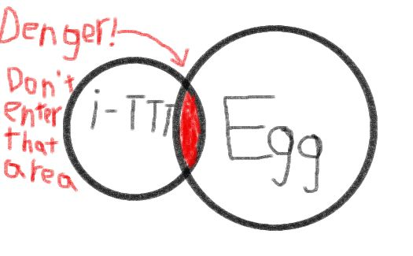

 

<h1>WHAT?</h1>
<h3>what?</h3>

A very WHAT? ~~Tic-Tac-Toe~~ game

[[简体中文]](https://github.com/06712L/idiot-Tic-Tac-Toe/blob/main/README-zh_CN.md) [[繁體中文]](https://github.com/06712L/idiot-Tic-Tac-Toe/blob/main/README-zh_HK.md) [[English]](https://github.com/06712L/idiot-Tic-Tac-Toe/blob/main/README.md) [[what]](https://github.com/06712L/idiot-Tic-Tac-Toe/blob/main/README-what.md)

## Introduction

It's not just Tic-Tac-Toe

## Implemented Features

- [x] WHAT?
    - [x] WHAT?
    - [x] WHAT?
    - [x] WHAT?
    - [x] WHAT?
- [x] WHAT?
    - [x] WHAT?
    - [x] WHAT?
        - [x] WHAT?
        - [x] WHAT?
        - [x] WHAT?
    - [x] WHAT?
    - [x] WHAT?
- [x] WHAT?

## Features

- You will find it
- **8** and **Egg**

## You need this

 

 

## How to WHAT?

1. Go to the [WHAT?](https://github.com/06712L/idiot-Tic-Tac-Toe/releases/tag/V0.4)
2. Download the WHAT for your WHAT?
3. Try

## Supported Platforms

- Linux *(WHAT?)*
- Windows *(WHAT?)*

## You don't need this

### Makefile

- `make linux` / `make`: Compile Linux executable
- `make win`: Compile Windows executable
- `make cleanlinux`: Clean all Linux build artifacts
- `make cleanwin`: Clean all Windows build artifacts
- `make clean`: Clean all build artifacts
- `make *** DEBUG=1`: Compile/clean debug version executable/build artifacts
- `make *** STATIC=1`: Package static library

### CMake

#### **NO**
