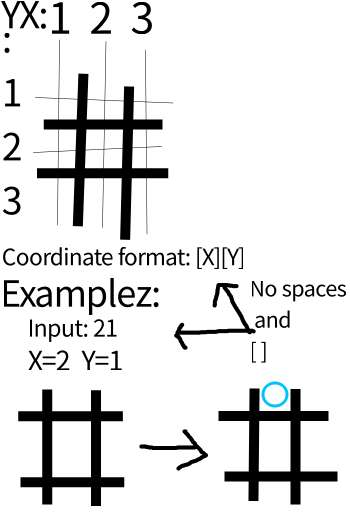

 

<h1>idiot-Tic-Tac-Toe</h1>
<h3>i-TTT</h3>

一个很白痴的井字棋游戏

[[简体中文]](https://github.com/06712L/idiot-Tic-Tac-Toe/blob/main/README-zh_CN.md) [[繁體中文]](https://github.com/06712L/idiot-Tic-Tac-Toe/blob/main/README-zh_HK.md) [[English]](https://github.com/06712L/idiot-Tic-Tac-Toe/blob/main/README.md)

## 介绍

这是一个井字棋项目毫无意义,它没有GUI,但它是全英文的所以建议看得懂基础英文的再下载

## 已实现功能

- [x] 井字棋核心
    - [x] 双人模式
    - [ ] AI vs 人类模式
    - [ ] 联网对战模式 *(没服务器我也不想做)*
- [x] 菜单
    - [x] 模式选择
    - [x] 设置 *(只有外表,没有功能)*
    - [x] 关于
    - [x] 如何玩教学
- [x] 发行版

## 特色功能

- 能双人对战
- CLI界面

## 如何玩？

 

 

## 建议配置

| 硬件 | 建议配置 |
| :--: | :--: |
| CPU | 任意一个 X86_64 架构处理器 |
| GPU | 能渲染就行 |
| RAM | 512MB+ |
| 存储空间 | 2MiB+ |
| 操作系统 | windows X86_64 / linux X86_64 |

## 支持平台

- Linux *(`.elf`)*
- windows *(`.exe`)*
